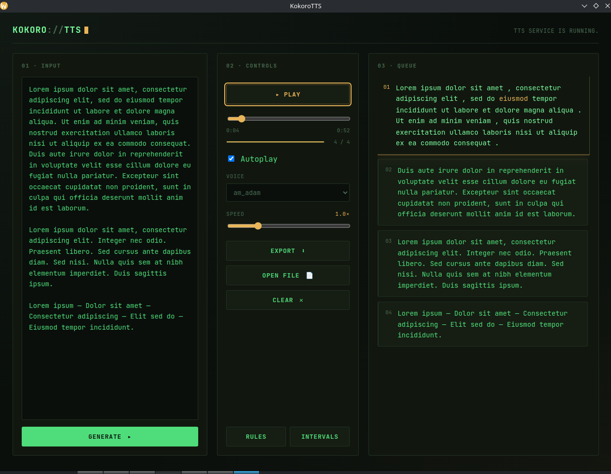

🇬🇧 [English version](README.md)

# KokoroTTS

Lokalny czytnik desktopowy, który zamienia tekst i dokumenty w mowę przy pomocy modelu [Kokoro-82M](https://huggingface.co/hexgrad/Kokoro-82M) — z podświetlaniem słów w czasie rzeczywistym, więc naprawdę widać, gdzie aktualnie jest czytanie, a nie tylko słychać.



## Po co

Większość czytników TTS to albo czarna skrzynka z przyciskiem "przeczytaj cały dokument", albo chmurowe API, któremu trzeba zaufać swój tekst. Ten łączy się z lokalnym serwisem [Kokoro-FastAPI](https://github.com/remsky/Kokoro-FastAPI), czyta książki i dokumenty zdanie po zdaniu i pokazuje dokładnie, które słowo jest właśnie wypowiadane — bliżej mu do karaoke niż do zwykłego odtwarzacza audiobooków.

## Funkcje

- **Podświetlanie czytania w czasie rzeczywistym** — podczas odtwarzania aktualnie wypowiadane słowo podświetla się w przewijanej kolejce zdań, zsynchronizowane z timestampami per słowo z Kokoro.
- **Czyta dokumenty, nie tylko czysty tekst** — TXT, MD, PDF, DOCX, ODT, RTF, EPUB, MOBI/AZW/AZW3, tekst jest wyciągany i czyszczony przed syntezą.
- **Streaming zdanie po zdaniu** — tekst generowany jest kawałek po kawałku zamiast jednego wielkiego requestu, więc odtwarzanie zaczyna się niemal od razu, a reszta generuje się w tle.
- **Sprytne dzielenie wokół dialogów** — własny tokenizer scala zdania w "tury mowy", więc synteza nigdy nie tnie w środku cytatu, i filtruje markery przejścia sceny (`***`, samotne myślniki), które nie są przeznaczone do czytania na głos.
- **Konfigurowalne Reguły** — popup w aplikacji do reguł regex find/replace (np. `Qi` → `chi`) stosowanych na tekście zanim trafi do silnika TTS — dla imion, skrótów czy jednostek, które model źle wymawia.
- **Konfigurowalne Interwały** — kolejny popup steruje długością pauzy między akapitami i scenami oraz maksymalną długością chunka syntezy, więc tempo da się dostroić pod konkretną książkę czy głos.
- **Eksport do MP3** — sklejenie wszystkich wygenerowanych zdań, z tymi samymi pauzami co przy odtwarzaniu, w jeden plik do pobrania.
- Miksowanie głosów, kontrola prędkości/głośności, lista głosów pobierana na żywo z backendu.

## Stos technologiczny

Python (pywebview + PyQt6/QtWebEngine) jako powłoka desktopowa · zwykły HTML/CSS/JS jako frontend (MediaSource Extensions dla płynnego odtwarzania zdań bez przerw) · `pdfplumber` / `python-docx` / `odfpy` / `striprtf` / `ebooklib` do ekstrakcji tekstu z dokumentów · `fast-sentence-segment` do dzielenia na zdania · [Kokoro-FastAPI](https://github.com/remsky/Kokoro-FastAPI) (Docker, obraz CPU lub GPU) jako backend TTS uruchamiający model Kokoro-82M.

## Podziękowania

Ta aplikacja jest frontendem zbudowanym na bazie [Kokoro-FastAPI](https://github.com/remsky/Kokoro-FastAPI) autorstwa remsky'ego — wrappera FastAPI (Apache 2.0) wokół modelu [Kokoro-82M](https://huggingface.co/hexgrad/Kokoro-82M). Cała właściwa synteza mowy dzieje się tam; ten projekt komunikuje się z jego API, karmi je dokumentami i buduje wokół niego interfejs czytania/podświetlania.

Dziękuję remsky'emu i projektowi Kokoro-FastAPI — dużo się nauczyłem, czytając ten kod podczas budowania własnego.

## Status

Projekt osobisty, aktywnie rozwijany. Główny pipeline — import dokumentu → generacja zdanie po zdaniu → odtwarzanie bez przerw → podświetlanie słów w czasie rzeczywistym → eksport MP3 — działa od początku do końca. Kilka drobnych rzeczy w UI (pozycja auto-scrolla kolejki, dopracowanie popupów) jest wciąż dopracowywanych.

## Uruchomienie

Najpierw backend TTS (osobny serwis, musi działać zanim uruchomisz aplikację):

```bash
# CPU
docker run -p 8880:8880 ghcr.io/remsky/kokoro-fastapi-cpu:latest

# GPU (NVIDIA)
docker run --gpus all -p 8880:8880 ghcr.io/remsky/kokoro-fastapi-gpu:latest
```

Potem sama aplikacja:

```bash
uv sync
python main.py
```
